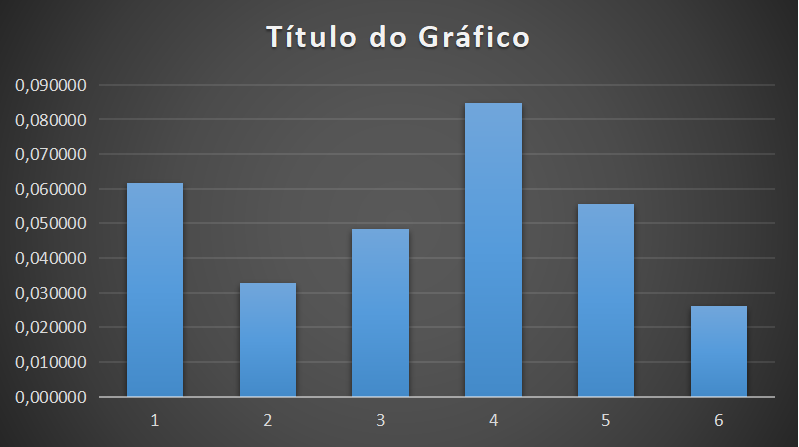
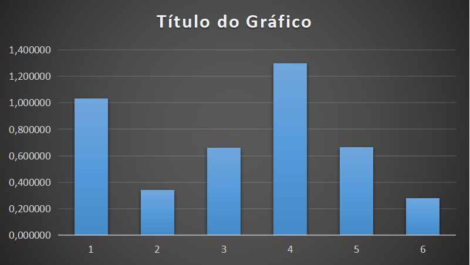
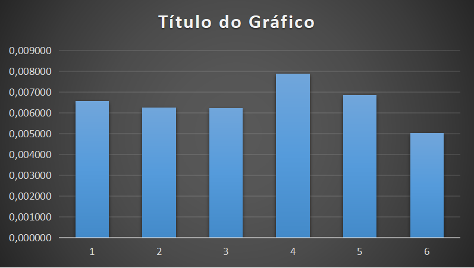
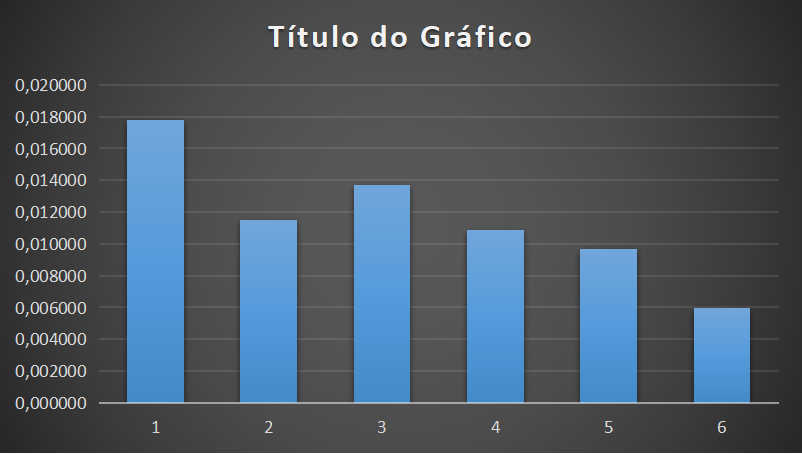
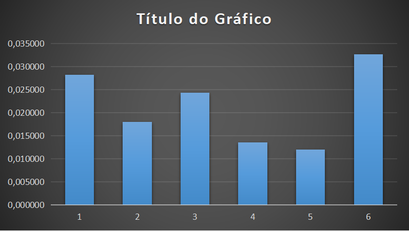
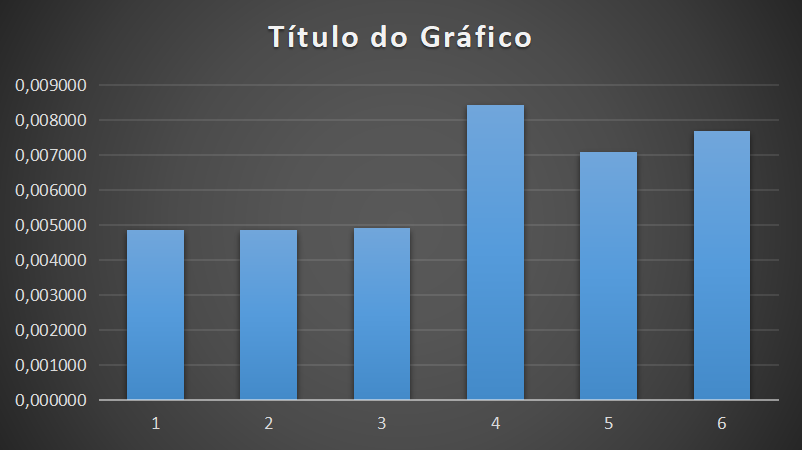

# Comparação das estruturas em árvore

# Problema
Até o momento trabalhamos com três modelos de árvore, binária, avl e redblack. Chegou o momento de compararmos tais estruturas, observando seu comportamento sob diferentes volumes de dados. Para tanto, elabore arquivos que contenham 500 , 5000 , 50.000 , 500.000 entradas numéricas do tipo ponto flutuante. Para tanto, tente evitar repetições de valores em grande escala para que possamos ter uma estrutura profunda. Considere produzir os menores a partir dos maiores volumes de forma randômica.

# Árvore Binária
Uma árvore binária é uma estrutura de dados caracterizada por:
Ou não tem elemento algum (árvore vazia).
Ou tem um elemento distinto, denominado raiz, com dois ponteiros para duas estruturas diferentes, denominadas subárvore esquerda e subárvore direita.
Perceba que a definição é recursiva e, devido a isso, muitas operações sobre árvores binárias utilizam recursão. É o tipo de árvore mais utilizado na computação. A principal utilização de árvores binárias são as árvores binárias de busca

# Árvore AVL
Árvore AVL é uma árvore binária de busca balanceada, ou seja, uma árvore balanceada (árvore completa) são as árvores que minimizam o número de comparações efetuadas no pior caso para uma busca com chaves de probabilidades de ocorrências idênticas. 

A Complexidade na Árvore de Busca Avl da da devida forma:

# Árvore Rubro-Negra
Uma árvore rubro-negra é um tipo de árvore binária de busca balanceada, uma estrutura de dados usada em ciência da computação, tipicamente para implementar vetores associativos. 
Uma árvore rubro-negra é uma árvore de busca binária onde cada nó tem um atributo de cor, vermelho ou preto. Além dos requisitos ordinários impostos pelas árvores de busca binárias, as árvores rubro-negras tem os seguintes requisitos adicionais:

1- Um nó é vermelho ou preto.
2- A raiz é preta. (Esta regra é usada em algumas definições. Como a raiz pode sempre ser alterada de vermelho para preto, mas não sendo válido o oposto, esta regra tem pouco efeito na análise.)</tr>
3- Todas as folhas(nil) são pretas.
4- Ambos os filhos de todos os nós vermelhos são pretos.
5-Todo caminho de um dado nó para qualquer de seus nós folhas descendentes contem o mesmo número de nós pretos.

# Algoritmo
Para a realização dessa atividade houve de ser implementada diversos  tipos de estruturas sendo elas Árvores Binária, AVL , Rubro-Negra(RB), Map,Unordered Map e Vector.

Grande maioria das funções apresentadas na estruturas de Árvores se manteve a mesma ou práticamente a mesma para todas (Binária,Avl,Rb), com exceção de algumas funções em expecifica na RB com o caso de Remoção 

O programa inicia chamando duas funções :
GeneratorFile() essa sendo responsavel pela geração dos arquivos de entrada proposto sendo cada um de 500,5000,50000,500000 de entradas respectivamente;
    

CreateFile()
CreateFile10000() essa função sendo responsavel pela geração do arquivo de pesquivo que possui 10000 entradas sendo que dessas 10000, 9000 fazem parte dos arquivos criados pelo GeneratorFile(), e as 1000 entradas restantes foram geradas aleatoriamente;
    

Essas Funções foram comentadas pelo motivo que uma vez geradas não precisam mais serem colocadas em execução, pois a cada momento que inicializar o Algoritmo essas funções demandariam de muita mémoria prejudicando assim o funcionamento do Programa;

Apos isso o usuário se depara com um Menu onde escolheram com qual arquivo deseja trabalhar
     

dentro do ultimo menu (Inserção, Remoção e Pesquisa), o usuário escolhe qual função deseja realizar que são definidas por ReadFile(), RemoveFile() e SearchFile() respectivamente.

Dentro de cada função todas os tipos de estrutura são executadas (Árvores Binária, AVL , Rubro-Negra(RB), Map,Unordered Map e Vector),

ReadFile()
      

RemoveFile()
      

SearcheFile()
      

# Resultado
Para gerar um resultado mais coerente foi feito a média de todas as Inserções, Pesquisas e Remoções de todos tipos de árvores, pode analizar os resultados pelos graficos abaixo; 
Todos os tempos foram dados em segundos;
1- Binária 2- AVL 3- Rubro Negra(RB) 4-Map 5- Unordered Map 6-Vector 

Inserção:
    500
    
    5000
    
    50000
    
    500000
    
    
Pesquisa:
    500
    
    5000
    
    50000
    
    500000
    

Remoção:
    500
    
    5000
    
    50000
    
    500000
    

# Perguntas
1) - Qual o tempo gasto com pesquisa para um arquivo de entrada com 10.000 consultas. Considere como consulta a busca de um determinado número na estrutura escolhida. Para cada pesquisa, é preciso remover o elemento da árvore, retornando esse número para o usuário. Então, considere o processo de remoção como parte final do processo. 

2) - Qual o tempo necessário para montar a estrutura em memória. 

3) - Qual o ganho dessas estruturas ao compará-las a vetores ordenados e aplicados à pesquisa binária. Qual o tempo gasto com a ordenação do vetor? Foi possível produzi-lo em memória? 

4) - Adotando como estrutura o map e unorder_map do C++, há ganhos maiores nesse processo de pesquisa?

# Resposta

1 - 2) Os tempos forão apresentados na hora da execução do programa e a média deles nos graficos presente nesse arquivo.

3) Ambas estruturas possuem vantagens e desvantagens mas ao observar os dados obtidos e analizar os gráficos a estrutura que obteve os melhores resultados foi o Vector;

4) Sim, a estrutura Map foi a que apresentou em média os melhores resultados.

| Comando                |  Função                                                                                           |
| -----------------------| ------------------------------------------------------------------------------------------------- |
|  `make clean`          | Apaga a última compilação realizada contida na pasta build                                        |
|  `make`                | Executa a compilação do programa utilizando o gcc, e o resultado vai para a pasta build           |
|  `make run`            | Executa o programa da pasta build após a realização da compilação                                 |